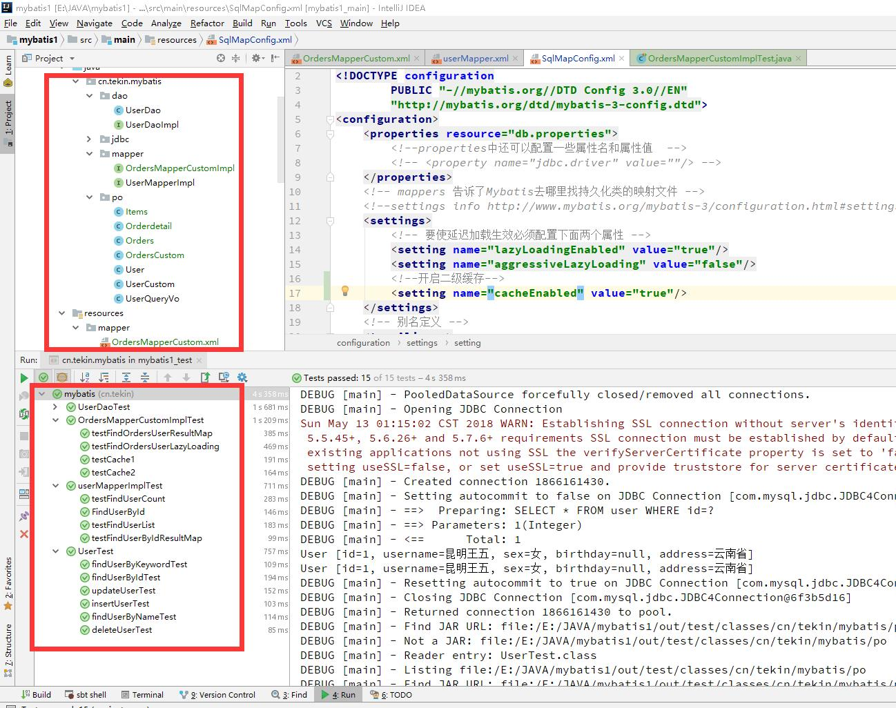

# Mybatis Demo Learning Project

本项目为学习mybatis基础的实例演示项目，从mybatis最基础的的演示到订单用户的多表复杂应用全部概括， 每个知识点都是一个完整的演示案例，详细查看 [Release页面>>](https://github.com/tekintian/mybatis_demo/releases)

 

---


## 版本列表

每个版本都是一个知识点的 完整演示

https://github.com/tekintian/mybatis_demo/tree/v0.1
https://github.com/tekintian/mybatis_demo/tree/v0.1.1
https://github.com/tekintian/mybatis_demo/tree/v0.2.0
https://github.com/tekintian/mybatis_demo/tree/v0.3.0
https://github.com/tekintian/mybatis_demo/tree/v0.4.0
https://github.com/tekintian/mybatis_demo/tree/v0.5.0
https://github.com/tekintian/mybatis_demo/tree/v0.5.1
https://github.com/tekintian/mybatis_demo/tree/v0.6.0
https://github.com/tekintian/mybatis_demo/tree/v0.7.0


---

##使用方法

- 数据库用户名创建与授权

    数据库名称：mybatis_demo   用户名：mybatis   密码：888888

```sql

-- ----------------------------
-- Table structure for user
-- ----------------------------
DROP TABLE IF EXISTS `user`;
CREATE TABLE `user`  (
  `id` int(11) NOT NULL AUTO_INCREMENT,
  `username` varchar(32) CHARACTER SET utf8 COLLATE utf8_general_ci NOT NULL COMMENT '用户名称',
  `birthday` date NULL DEFAULT NULL COMMENT '生日',
  `sex` char(1) CHARACTER SET utf8 COLLATE utf8_general_ci NULL DEFAULT NULL COMMENT '性别',
  `address` varchar(256) CHARACTER SET utf8 COLLATE utf8_general_ci NULL DEFAULT NULL COMMENT '地址',
  PRIMARY KEY (`id`) USING BTREE
) ENGINE = InnoDB AUTO_INCREMENT = 27 CHARACTER SET = utf8 COLLATE = utf8_general_ci ROW_FORMAT = Dynamic;


-- ----------------------------
-- Records of user
-- ----------------------------
INSERT INTO `user` VALUES (1, '昆明王五', NULL, '2', '云南省');
INSERT INTO `user` VALUES (10, '张三', '2014-07-10', '1', '北京市');
INSERT INTO `user` VALUES (16, '张小明', NULL, '1', '云南省昆明');
INSERT INTO `user` VALUES (22, '陈小明', NULL, '1', '云南省昆明');
INSERT INTO `user` VALUES (24, '张三丰', NULL, '1', '四川成都');
INSERT INTO `user` VALUES (25, '陈小明', NULL, '1', '云南省昆明');
INSERT INTO `user` VALUES (26, '深圳王五', NULL, NULL, '广东深圳');


-- ----------------------------
-- create database user mybatis and 
-- grant all privilege to mybatis_demo database on localhost
-- ----------------------------
CREATE USER `mybatis`@`localhost` IDENTIFIED BY '888888';

GRANT Alter, Alter Routine, Create, Create Routine, Create Temporary Tables, Create View, Delete, Drop, Event, Execute, Grant Option, Index, Insert, Lock Tables, References, Select, Show View, Trigger, Update ON `mybatis\_demo`.* TO `mybatis`@`localhost`;
```
---
## mybatis数据库连接参数配置注意事项

- characterEncoding=utf-8 设置与数据库通讯所使用的编码；
- useSSL=false 
```text
高版本的MYSQL必须添加，否则无法连接，注意连接符 & 需要使用实体模式，即：&amp;
```

- characterEncoding=UTF-8 指定与数据库通讯使用的编码。

- useUnicode=true 如果你的数据库的编码非utf-8则需要指定此参数

   例如：mysql数据库用的是gbk编码，而项目数据库用的是utf-8编码。这时候如果添加了useUnicode=true&characterEncoding=UTF-8 ，那么作用有如下两个方面：
    
    1. 存数据时：数据库在存放项目数据的时候会先用UTF-8格式将数据解码成字节码，然后再将解码后的字节码重新使用GBK编码存放到数据库中。
    
    2. 取数据时：在从数据库中取数据的时候，数据库会先将数据库中的数据按GBK格式解码成字节码，然后再将解码后的字节码重新按UTF-8格式编码数据，最后再将数据返回给客户端。

---
完整的连接地址：
```text
jdbc:mysql://localhost:3306/mybatis_demo?characterEncoding=utf-8&amp;useSSL=false
```

## new Date() Cannot resolve constructor 'Date()'解决方法
    此问题主要是要 解决java.util.Date转java.sql.Date,在对于java.sql.Date、Time、Timestamp构造器都存在着对应的有参构造器Date(long time)、Time(long time)、Timestamp(long time)。

```java
//将java.util.Date 获取的时间转换为 java.sql.Date
java.sql.Date sqlDate=new java.sql.Date(new java.util.Date().getTime());

```

# Junit4使用
- @Before：
    使用了该元数据的方法在每个测试方法执行之前都要执行一次。

- @After：
    使用了该元数据的方法在每个测试方法执行之后要执行一次。

    注意：@Before和@After标示的方法只能各有一个。这个相当于取代了JUnit以前版本中的setUp和tearDown方法，当然你还可以继续叫这个名字，不过JUnit不会霸道的要求你这么做了。

- @Test(expected=*.class)
    在JUnit4.0之前，对错误的测试，我们只能通过fail来产生一个错误，并在try块里面assertTrue（true）来测试。现在，通过@Test元数据中的expected属性。expected属性的值是一个异常的类型

- @Test(timeout=xxx):
    该元数据传入了一个时间（毫秒）给测试方法，
    如果测试方法在制定的时间之内没有运行完，则测试也失败。

- @ignore：
    该元数据标记的测试方法在测试中会被忽略。当测试的方法还没有实现，或者测试的方法已经过时，或者在某种条件下才能测试该方法（比如需要一个数据库联接，而在本地测试的时候，数据库并没有连接），那么使用该标签来标示这个方法。同时，你可以为该标签传递一个String的参数，来表明为什么会忽略这个测试方法。比如：- @lgnore(“该方法还没有实现”)，在执行的时候，仅会报告该方法没有实现，而不会运行测试方法。


## JUnit4注解解释

    1. @Test : 测试方法，测试程序会运行的方法，后边可以跟参数代表不同的测试，如(expected=XXException.class) 异常测试，(timeout=xxx)超时测试
    2. @Ignore : 被忽略的测试方法
    3. @Before: 每一个测试方法之前运行
    4. @After : 每一个测试方法之后运行
    5. @BeforeClass: 所有测试开始之前运行
    6. @AfterClass: 所有测试结束之后运行

    fail方法是指测试失败

    assertEquals测试2个参数是否相等，具体参考相应API


## 项目依赖 gradle dependencies

    dependencies {
        compile group: 'org.ow2.asm', name: 'asm', version: '6.1.1'
        compile group: 'cglib', name: 'cglib', version: '3.2.6'
        compile group: 'commons-logging', name: 'commons-logging', version: '1.2'
        compile group: 'org.javassist', name: 'javassist', version: '3.22.0-GA'
        compile group: 'log4j', name: 'log4j', version: '1.2.17'
        compile group: 'org.apache.logging.log4j', name: 'log4j-core', version: '2.11.0'
        compile group: 'org.apache.logging.log4j', name: 'log4j-api', version: '2.11.0'
    
        compile group: 'org.mybatis', name: 'mybatis', version: '3.4.6'
        compile group: 'mysql', name: 'mysql-connector-java', version: '5.1.46'
        compile group: 'org.slf4j', name: 'slf4j-api', version: '1.8.0-beta2'
        testCompile group: 'org.slf4j', name: 'slf4j-log4j12', version: '1.8.0-beta2'
    
        testCompile group: 'junit', name: 'junit', version: '4.12'
    }
      

## Date相互转换 
1. 使用getTime()函数
这两个类都提供了getTime()函数，用于返回对应的毫秒数（long类型）。利用这个函数可以实现转换：
    java.util.Date utilDate = newjava.util.Date(sqlDate.getTime());   // sql -> util
    java.sql.Date sqlDate = newjava.sql.Date(utilDate.getTime());   // util -> sql

2. 使用SimpleDateFormat类实现转换
SimpleDateFormat 是一个以国别敏感的方式格式化和分析数据的具体类。 它允许格式化 (date-> text)、语法分析 (text -> date)和标准化。
SimpleDateFormat dateFormat = new SimpleDateFormate("yyyy-MM-ddHH:mm:ss");
java.util.Date utilDate = dateFormat.parse(sqlDate.toString());

3. 直接转换
由于java.sql.Date是从java.util.Date中继承过来的，所以可以直接用：
utilDate = sqlDate;

4. 另类获得日期的方法：
SimpleDateFormat sy=new SimpleDateFormat("yyyy");
SimpleDateFormat sm=new SimpleDateFormat("MM");
SimpleDateFormat sd=new SimpleDateFormat("dd");
String syear=sy.format(date);
String smon=sm.format(date);
String sday=sd.format(date);

ps： java.util.Date类中的getYear()要加上1900才可得到实际值，getMonth()则要加上1      


# mybatis 的几个简单区别

1、#{ } 和 ${ } 的区别
```text
#{ }表示一个占位符号，通过#{ }可以实现 preparedStatement 向占位符中设置值，自动进行java 类型和 jdbc 类型转换，#{ } 可以有效防止sql注入。#{ } 可以接收简单类型值或 pojo 属性值（通过 OGNL 读取对象中的值，属性.属性.属性..方式获取对象属性值）。 如果 parameterType 传输单个简单类型值，#{ } 括号中可以是 value 或其它名称。

${ } 表示拼接 sql 串，通过${ }可以将 parameterType 传入的内容拼接在 sql 中且不进行 jdbc 类型转换， ${ }可以接收简单类型值或 pojo 属性值（（通过 OGNL 读取对象中的值，属性.属性.属性..方式获取对象属性值）），如果 parameterType 传输单个简单类型值，${}括号中只能是 value。

```

2、parameterType 和 resultType 区别

    parameterType：指定输入参数类型，mybatis 通过 ognl 从输入对象中获取参数值拼接在 sql 中。

    resultType：指定输出结果类型，mybatis 将 sql 查询结果的一行记录数据映射为 resultType 指定类型的对象。

3、selectOne 和 selectList 区别

    selectOne 查询一条记录来进行映射，如果使用selectOne查询多条记录则抛出异常：
    
    org.apache.ibatis.exceptions.TooManyResultsException: Expected one result (or null) to bereturned by selectOne(), but found: 3 at
    
    selectList 可以查询一条或多条记录来进行映射。

4、注意:

    selectKey将主键返回，需要再返回
    
    添加selectKey实现将主键返回
    
    keyProperty:返回的主键存储在pojo中的哪个属性
    
    order：selectKey的执行顺序，是相对与insert语句来说，由于mysql的自增原理执行完insert语句之后才将主键生成，所以这里selectKey的执行顺序为after
    
    resultType:返回的主键是什么类型
    
    LAST_INSERT_ID():是mysql的函数，返回auto_increment自增列新记录id值。

---


## MyBatis中的statementType详解
在mapper文件中可以使用statementType标记使用什么的对象操作SQL语句。 
statementType：标记操作SQL的对象 

- 取值说明：

1. STATEMENT:直接操作sql，不进行预编译，获取数据：$—Statement 
2. PREPARED:预处理，参数，进行预编译，获取数据：#—–PreparedStatement:默认 
3. CALLABLE:执行存储过程————CallableStatement 

其中如果在文件中，取值不同，那么获取参数的方式也不相同

### 示例代码：

    <!-- STATEMENT -->
    <update id="statement_update" statementType="STATEMENT">
        update tb_car set name=${name} where id=${id}
    </update>
    
     <!-- PREPARED -->
    <update id="prepared_update" statementType="PREPARED">
         update tb_car set name=#{name} where id=#{id}
    </update>
    
    <!-- CALLABLE -->
    <update id="prepared_update" statementType="PREPARED">
        call sp_my_update (
             #{id ,mode=IN},
             #{name ,mode=IN},
             #{out_user_id,mode=OUT,jdbcType=INTEGER}
           )
    </update>
    
注意：如果只为STATEMENT，那么sql就是直接进行的字符串拼接，这样如果为字符串需要加上引号，如果为PREPARED，是使用的参数替换，也就是索引占位符，我们的#会转换为?再设置对应的参数的值。


